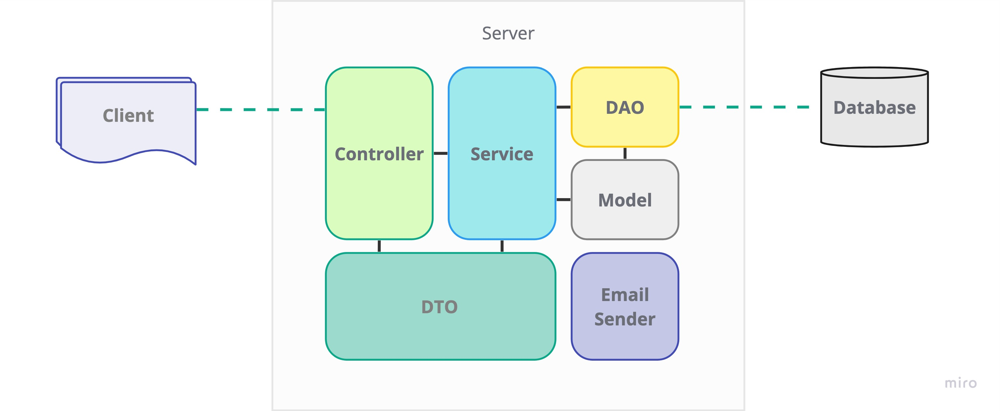

<h3>Архитектура и модули</h3>

<b>Controller</b> - отвечает за обработку REST-запросов, маршрутизацию, валидацию данных, взаимодействие с сервисами, формирование ответов и обработку ошибок. Обеспечивает связь между клиентом и остальными компонентами приложения.

<b>Service</b> - отвечает за бизнес-логику, взаимодействие с данными и управление доступом.

<b>Model</b> - содержит классы-сущности приложения, предназначенные для взаимодействия с базой данных

<b>DTO</b> - модуль объектов для передачи данных между компонентами приложения.

<b>DAO</b> - предоставляет абстракцию для работы с данными и обеспечивает разделение между бизнес-логикой приложения и механизмами доступа к данным.

<b>Email Sender</b> - модуль рассылки уведомлений по email

<h3>Блоки задач</h3>

| Блок                                | Описание                                                                                      |
|-------------------------------------|:----------------------------------------------------------------------------------------------|
| Разработка классов бизнес-сущностей | Создать классы моделей на основе представленных бизнес сущностей                              |
| Разработка слоя работы с данными    | Реализовать слой работы с БД на основе описанных моделей                                      |
| Разработка DTO                      | Создать классы DTO для соответствующих моделей и необходимых комбинаций данных                |
| Разработка сервисного слоя          | Реализовать бизнес-логику для всех необходимых операций с представленными сущностями.         |
| Разработка конечных точек           | Создать конечные точки REST для взаимодействия с бизнес-логикой                               |
| Ограничение доступа                 | Настроить ограничение доступа к конечным точкам для неавторизованных пользователей            |
| Дополнительные функции              | Реализовать дополнительную функциональность (работа с файлами, отправка уведомлений по email) |
| Служебная функциональность          | Настроить логирование. Покрыть систему тестами.                                               |